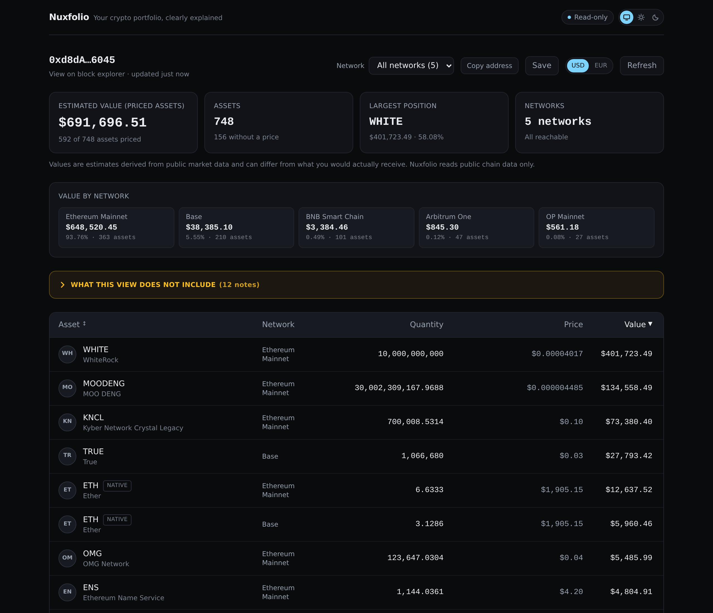
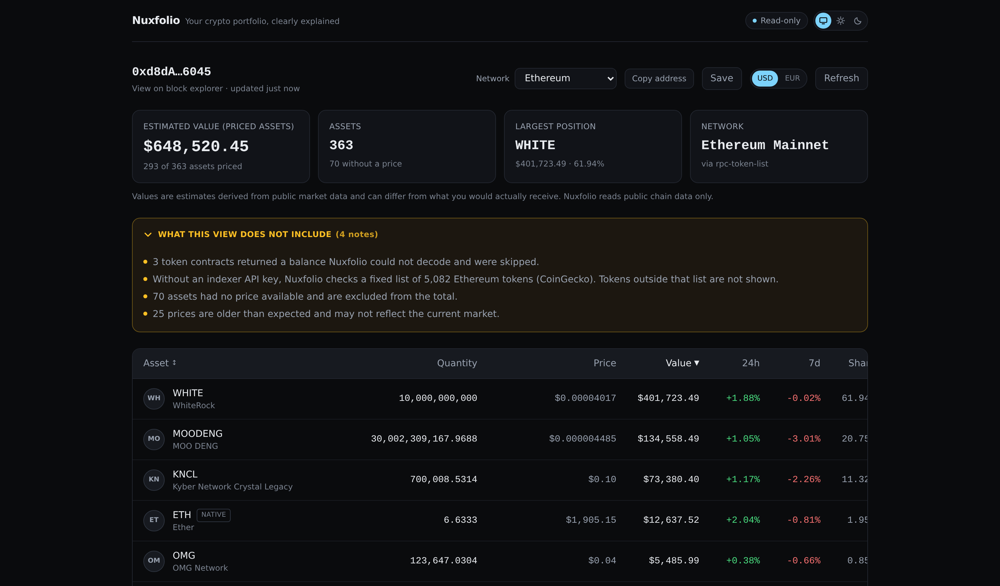
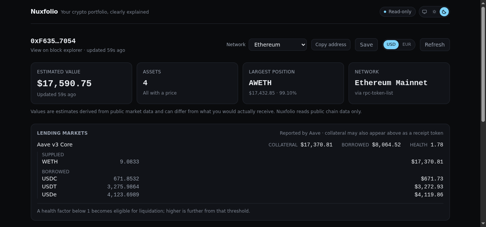
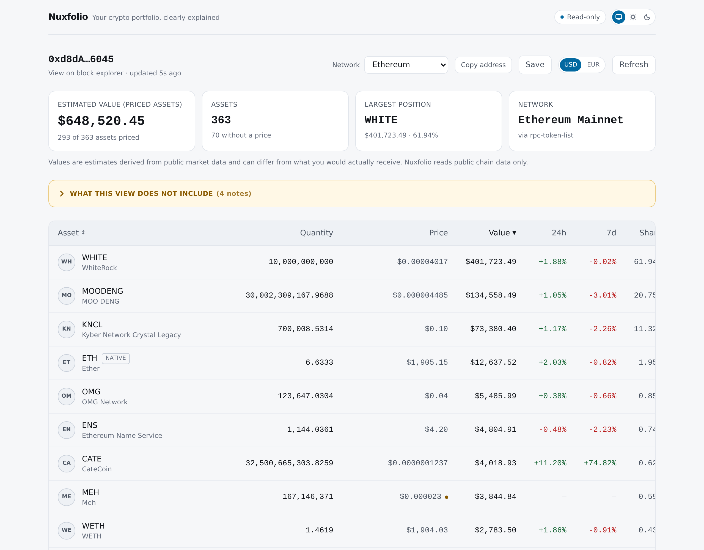
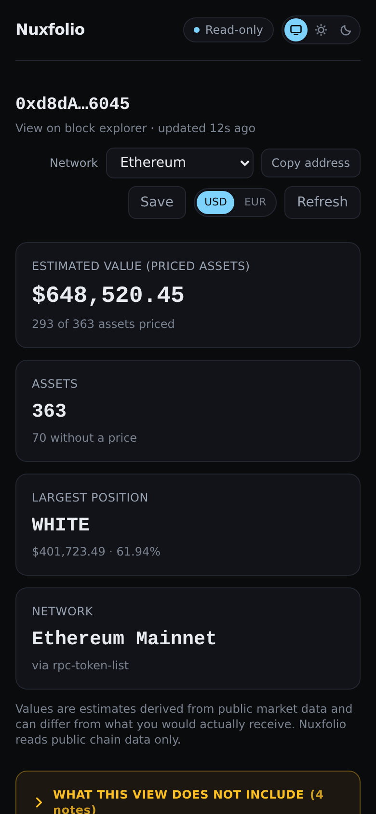

# Nuxfolio

**Your crypto portfolio, clearly explained.**

A read-only crypto portfolio tracker. Enter a public EVM wallet address and see
what it holds across **Ethereum, Base, Arbitrum, Optimism and BNB Chain**, what
it is worth today, and where the concentration sits — with the gaps in that
picture stated rather than hidden.

There is no wallet connection, no signing path, and no code in this repository
that could move funds. Nuxfolio never asks for a seed phrase or private key.



<sub>A real wallet (`vitalik.eth`), read with no API key at all. Five networks,
one total, and the caveats folded into a line that still says how many there are.</sub>

### The part most trackers leave out

Every portfolio tracker can show you a number. The harder problem is being straight
about the number's edges — what was not priced, not covered, or out of date. Nuxfolio
treats that as a feature rather than an embarrassment, so the gaps are one click away
instead of absent:



<sub>Four distinct admissions: contracts that would not decode, tokens outside the
bundled list, assets with no price at all, and prices older than expected. Each is a
different problem, so each is reported as a different thing.</sub>

### Lending positions, beside the assets rather than inside them



<sub>A real borrower. Aave's own figures — collateral, debt, and the health factor with
the one sentence that makes it mean anything — broken down into the assets they are made
of. The rows are priced by the same oracle as the totals, so they add up to them exactly.
None of it is summed into the portfolio total above, because that is priced by a
different source; and the note says collateral <em>may</em> also appear above as a
receipt token, because for many wallets it already does.</sub>

<details>
<summary>Light theme, and on a phone</summary>





<sub>Both themes meet WCAG AA on every text pair, enforced by a test that reads the
real stylesheet rather than trusting the palette. The narrow layout is covered by an
end-to-end test asserting the page never scrolls sideways at 390px.</sub>

</details>

---

## Quick start

Requires Node.js 20.9+ (this repo pins 24.18.1 in `.nvmrc`) and pnpm.

```bash
nvm use                # or: nvm install
pnpm install
pnpm dev
```

Open <http://localhost:3000> and paste a public address or a `.eth` name, or
follow the example wallet link on the landing page.

**No API key is needed.** With no configuration at all, Nuxfolio reads real
balances from public RPC endpoints on five networks and real prices from a public
market-data API. What that costs you is coverage: without an indexer key it
checks bundled token lists — roughly 12,000 tokens across the five chains — and it says
so on every response.

Two optional free keys each add something:

```bash
cp .env.example .env.local
# ALCHEMY_API_KEY=...     complete token discovery instead of bundled lists
# COINGECKO_API_KEY=...   a second price source, so prices get cross-checked
```

Nuxfolio switches to the indexed provider automatically when the Alchemy key is
present, and starts cross-checking prices when the CoinGecko key is. Neither is
required and neither produces a warning when absent — running on one price source
is the default state, not a fault. `.env.local` is git-ignored; no configuration
value is ever sent to the browser.

## Commands

| Command                | What it does                                   |
| ---------------------- | ---------------------------------------------- |
| `pnpm dev`             | Development server on port 3000                |
| `pnpm build`           | Production build                               |
| `pnpm start`           | Serve the production build                     |
| `pnpm test`            | Run the test suite once                        |
| `pnpm test:watch`      | Run tests in watch mode                        |
| `pnpm test:e2e`        | Playwright wiring smoke tests in Chromium      |
| `pnpm typecheck`       | `tsc --noEmit`                                 |
| `pnpm lint`            | ESLint                                         |
| `pnpm format`          | Prettier, writing changes                      |
| `pnpm format:check`    | Prettier, checking only                        |
| `pnpm verify`          | format:check → lint → typecheck → test → build |
| `pnpm tokens:generate` | Refresh the bundled token lists (all 5 chains) |

## What it does

- Validates and checksums any EVM address before doing anything with it.
- Resolves `.eth` names server-side, then redirects to the address URL, so a
  shared link always names the wallet it shows: `/portfolio/vitalik.eth` becomes
  `/portfolio/0xd8dA…6045?ens=vitalik.eth`.
- Reads native and ERC-20 balances across five networks at once, or one at a
  time, with a per-network value breakdown.
- Resolves USD prices, then computes values, a priced subtotal, and each
  holding's share of it — all with decimal arithmetic, never floating point.
- With a CoinGecko key, confirms the prices that matter to the total against a
  second source and marks any disagreement beyond 2 %.
- Shows 24-hour and 7-day price change, computed from two dated observations and
  withheld whenever it cannot be stated honestly.
- Shows figures in US dollars or euros, converted at the ECB reference rate with
  that rate's own date named.
- Reads lending positions from Aave v3 — collateral, debt, the health factor, and
  which assets each of those is made of — across seven markets on five chains. Shown
  beside the wallet's assets and never added into their total, because they are priced
  by Aave's own oracle (ADR-026); the per-asset rows are priced by that same oracle, so
  they sum to the totals above them to the base unit (ADR-027).
- Sorts by value or by name, in both directions, with the choice carried in the URL so
  a sorted view can be shared or reloaded.
- Renders loading, empty, partial-data, unpriced, rate-limited and error states.
- Gives every wallet a shareable URL: `/portfolio/0x…` for all networks, or
  `?chainId=1` for one.
- Saves wallets you look at often, listed on the landing page — in your browser, so
  there is no account and no server-side record of what you watch.
- Totals several wallets at once: `/bundle/0xA,0xB,0xC`, shareable as a link, with each
  wallet's own subtotal shown beside the combined figure.
- Copies the full address in one click — the full one, never the shortened form on
  screen — and links each network card straight to that network on its own.
- Works on desktop and mobile, in light or dark, following your system by
  default. Both palettes meet WCAG AA contrast on every text pair. The asset table is
  fully operable from the keyboard.

## What it does not do (yet)

Wallet connection, signing, swaps, transfers, transaction history, tax, historical
charts, non-EVM chains, and AI analysis are all out of scope for this milestone.
Saved wallets do not sync between devices — that needs accounts, which is a separate
decision.

Note on DeFi: holdings held as ERC-20 receipt tokens — wstETH, syrupUSDC,
stkAAVE, crvUSD and similar — **are** shown, because mechanically they are just
tokens in the wallet. **Aave v3 borrowing is also shown**: collateral, debt and the
health factor, read from the protocol's own accounting rather than inferred from
tokens (ADR-026) — and, per market, **which assets** those totals are made of. Rows are
priced by the market's own oracle, so they sum to the totals above them exactly
(ADR-027) — and any unclaimed incentives the market owes (ADR-028). What is still missing
is any lending protocol other than Aave v3, and LP composition.

Adding a sixth chain is one registry entry plus `pnpm tokens:generate`.

## Honesty, as a feature

Most of the interesting behaviour in this codebase is about _not_ overstating
what is known:

- The headline figure is a **subtotal of priced assets**, labelled as such. If
  nothing could be priced it shows as unavailable — never as `$0.00`, which would
  be a claim that the wallet is worthless.
- A lending market with no position renders as **nothing**, a market that could not
  be read renders as "Could not be read", and only a successful read shows a figure.
  A row of zeros would claim the wallet has no debt when nobody managed to ask.
- Percentages are shares of that priced subtotal. An unpriced asset gets no
  share rather than a misleading `0.00%`.
- Old, low-confidence, or undated quotes are **kept and flagged**, not silently
  dropped — dropping them would make the subtotal quietly wrong. A provider that
  reports no timestamp has not told us the price is fresh, so that is shown as
  unknown rather than assumed.
- A **price change is withheld more often than shown**. No figure when the current
  price is stale, low-confidence, undated, or disputed by the second source; none
  when the past observation is too far from the period claimed. Every dash carries
  its reason, and a real change too small for two decimals reads `<0.01%` rather
  than the `0.00%` that would assert the opposite (ADR-020).
- A **euro figure is a conversion of an estimate at a dated rate**, and says so.
  The ECB publishes on business days, so the rate can be several days old; the page
  names the rate and its date rather than implying a live quote (ADR-021).
- When a second price source is configured, a **disagreement is reported, not
  resolved**. Nuxfolio does not know which source is right, so the primary price
  stays in the total, the row is marked, and both figures are shown. The summary
  says how many prices were checked, because the table marks only the
  disagreements — and silence must not read as endorsement (ADR-019).
- Assets that look like scam airdrops — an off-list contract impersonating a
  listed token's symbol, or a name that is a web address — are **excluded from
  the total and accounted for**: the count, the excluded value and each row's
  reason are all shown in a section of their own. A doubtful price is a doubt
  about value and stays in the total; a spoofed symbol is a doubt about whether
  the asset is yours at all, which is a different claim (ADR-014).
- Sub-dollar rows are folded into one expander instead of burying the holdings
  that matter. That is presentation only — nothing is excluded from a total, and
  unpriced assets stay in the main table where they can be seen.
- When the token scan is partial, a batch fails, or discovery hits a ceiling, the
  response says what was not checked and the UI shows it.
- A bundled token list older than `TOKEN_LIST_MAX_AGE_DAYS` (default 60) says its
  own age, because a list that stopped being regenerated understates a portfolio
  without anything failing.
- An ENS name in the header is labelled "entered as": a forward lookup says where
  the name pointed, not that the wallet owns the name.
- A network that could not be read is shown as "Unavailable" next to the ones
  that could, never quietly dropped from the total.
- Values are labelled estimates from public market data, not executable quotes.
- Display formatting never routes a decimal through `number`, so a dust holding
  renders as the number it is instead of `0`, and a large balance keeps every
  digit.

## Architecture

```text
src/
  app/          Routes: landing page, /portfolio/[address], /api/portfolio
  components/   Presentational React — no fetching or provider logic
  server/       Cache, rate limiter, HTTP client, deadline, logger, service
  providers/    Adapters behind PortfolioProvider / PriceProvider / PriceVerifier
  domain/       Types and zod schemas, address rules, decimal maths, normalisation,
                price-change and insight rules
  config/       Chain registry, validated server env, bundled token lists
  lib/          Browser-side API client and display formatting
```

Dependencies run one way: `app → server → providers → domain`. Adapters parse
their own responses with zod and return normalised domain objects, so no raw
provider payload — or URL, or credential — reaches the service layer or the UI.

A request works like this:

```text
GET /api/portfolio?address=…&chainId=1        one network
GET /api/portfolio?address=…&chainId=all      every network
  ├─ rate limit (per client, fixed window)
  ├─ per chain, up to CHAIN_SCAN_CONCURRENCY at once:
  │    ├─ cache lookup (60 s TTL, concurrent misses coalesced)
  │    ├─ PortfolioProvider.fetchBalances()   ← partial results kept + warned
  │    ├─ PriceProvider.fetchPrices()         ← failure degrades to quantities
  │    ├─ PriceVerifier.verify()              ← optional; failure degrades to a warning
  │    └─ buildPortfolio()                    ← decimal maths, shares, sorting
  ├─ buildAggregatePortfolio()                ← a failed chain is reported, not dropped
  └─ zod-validated JSON
```

The all-networks **page** does not take the `chainId=all` line. The browser asks
for one network at a time, concurrently, and combines the answers as they arrive,
so a fast network renders without waiting for the slowest one and each figure is
labelled with how many networks it covers until every one has settled. Same
server cache, same domain arithmetic, five rate-limit tokens instead of one;
`chainId=all` stays the single-request path for API callers. See ADR-015.

Further reading:

- [`docs/IMPLEMENTATION_PLAN.md`](docs/IMPLEMENTATION_PLAN.md) — scope and structure
- [`docs/DECISIONS.md`](docs/DECISIONS.md) — why things are the way they are
- [`docs/PROVIDERS.md`](docs/PROVIDERS.md) — providers, limits, costs, replacement
- [`docs/REVIEW_LOG.md`](docs/REVIEW_LOG.md) — independent review findings and dispositions
- [`docs/DEV_PLAN.md`](docs/DEV_PLAN.md) — checkpoint and the roadmap forward (M2–M7)

## Configuration

Every variable is optional; see [`.env.example`](.env.example) for the full list
with defaults. The ones that matter most:

| Variable                      | Default          | Purpose                                           |
| ----------------------------- | ---------------- | ------------------------------------------------- |
| `ALCHEMY_API_KEY`             | —                | Enables complete token discovery                  |
| `COINGECKO_API_KEY`           | —                | Enables the price cross-check (free Demo plan)    |
| `PRICE_HISTORY_MAX_ASSETS`    | `50`             | Per-chain cap on 24 h / 7 d lookups               |
| `PRICE_DISPUTE_TOLERANCE`     | `0.02`           | Divergence before a price is marked disputed      |
| `ETHEREUM_RPC_URLS`           | public endpoints | Comma-separated RPC endpoints, tried in order     |
| `PORTFOLIO_CACHE_TTL_SECONDS` | `60`             | How long a portfolio is reused                    |
| `RATE_LIMIT_MAX_REQUESTS`     | `30`             | Requests per client per window                    |
| `TRUST_PROXY_HEADERS`         | `false`          | Set to `true` **only** behind a proxy you control |
| `REQUEST_DEADLINE_MS`         | `15000`          | Total upstream budget for one request             |
| `LOG_LEVEL`                   | `info`           | `debug` \| `info` \| `warn` \| `error`            |

`TRUST_PROXY_HEADERS` is worth understanding before deploying: forwarding headers
are caller-controlled, so trusting them by default would let anyone bypass the
rate limiter by sending a fresh value per request. Left `false`, unidentified
callers share one bucket with a higher ceiling. See ADR-008.

## Security posture

- Read-only. No signing, no key handling, no transaction construction anywhere.
- The theme preference is the only thing stored in your browser, and only if you
  pick one; "match system" stores nothing at all.
- Credentials are server-side only. `config/env.ts` is marked `server-only`, so
  an accidental client import is a build error rather than a silent leak.
- Logs are redacted by construction: credentials, full wallet addresses and long
  hex runs are masked in the logger, not at each call site.
- Error responses carry a fixed shape — a stable code and one safe sentence.
  Upstream messages, URLs and stack traces stay in the server log.
- Every external payload is parsed with zod before it is trusted.
- Outbound requests have per-attempt timeouts, a capped retry policy, and one
  shared end-to-end deadline.
- The browser makes no third-party requests: no webfonts, no logo CDN, no
  analytics.

## Known limitations

1. Without `ALCHEMY_API_KEY`, only bundled-list tokens are found — roughly 12,000 across
   five networks. Surfaced in the UI on every request.
2. The cache and rate limiter are in-process, so they are per-instance. Correct
   for a single node; a shared store is needed before scaling horizontally.
3. Without `COINGECKO_API_KEY`, prices come from one source with no cross-check.
   With it, the check covers 95 % of each network's value (capped at 25 assets)
   rather than every asset, because the free quota is finite — and assets left
   unchecked are reported as unchecked, never as confirmed.
4. Spam and scam tokens are identified by two deterministic identity checks — a
   symbol copied from a listed token, and claim-bait naming — and excluded from the
   total with the excluded rows and their value shown, never silently dropped
   (ADR-014). The comparison is on what a name _renders_ as, so invisible characters
   and Cyrillic or Greek lookalikes do not evade it. What it does not do is judge
   intent: a token on the bundled list is always trusted, and the confusable map is a
   curated subset of Unicode rather than all of it.
5. No persistence and no history — every load is a live read.
6. Protocol accounting is read for **Aave v3 and Convex** — no other lending protocol
   and no LP composition. Convex is read because its reward contract owns the staked
   Curve LP, so no balance read can see it; Lido and Curve were dropped from the
   milestone after measuring that their tokens are already listed and already counted.
   Convex **rewards** are not read at all: CVX is minted on a schedule rather than held,
   so a figure from the pool contracts alone would understate. Within Aave it is complete: collateral, debt, the health factor, which
   assets each is made of, and unclaimed incentives. The page says what it does not cover
   rather than leaving it to be discovered: the lending panel's caption leads with "Aave
   v3 only", and a caveat states it on every wallet, including one with no lending panel
   at all — which is the wallet that cannot otherwise tell "not checked" from "nothing
   there".
7. The net-of-debt figure is **net of Aave debt only**, on the chains this product
   reads. It is not a net worth: a Compound loan is not in it, which is why the coverage
   statement above is a prerequisite rather than a separate feature. It also mixes two
   price sources — the assets are priced by DefiLlama and the Aave position by Aave —
   which cost $4.03 on a $17,600 wallet when measured. It is absent entirely whenever it
   cannot be computed exactly, including when any market could not be read (ADR-029).

## Testing

```bash
pnpm test
```

The suite is network-free by construction: adapters take `fetch` from an injected
provider context, and every test supplies its own stub. Covered: address
validation and normalisation, palette contrast against WCAG AA in both themes
(read from the real stylesheet, so it fails if a colour regresses), decimal
arithmetic against the cases where floats fail, portfolio normalisation,
percentage calculations, missing and flagged prices, price-disagreement detection
and which assets are worth checking, provider error taxonomy, partial-failure
handling, HTTP retry and deadline behaviour, cache coalescing and eviction, rate
limiting, log redaction, the API route contract, and the UI state machine.

```bash
npx playwright install chromium   # once
pnpm test:e2e
```

`pnpm test:e2e` runs the end-to-end smoke tests in `e2e/`: thirty-one scenarios that
drive a real browser against a **production build** on port 3100 (ADR-017) and
check the wiring the unit suite cannot reach — landing page to rendered portfolio,
an unreachable network shown as unavailable, an invalid address rejected inline, a
rate limit offering a retry, the empty state, an empty wallet that must not claim
a network it never read was empty, a theme choice applied before first paint, a
disputed price marked while staying in the total, checks that came back
unconfirmed not being reported as agreement, the CoinGecko attribution appearing
when and only when its data was used, a real 0.004 % change refusing to render as
`0.00%`, a euro conversion that divides rather than multiplies, and a 390 px
viewport that does not scroll sideways. Every `/api/portfolio` response is mocked in the browser, so
no provider is called. It is deliberately outside `pnpm verify` — which stays fast
and needs no browser download — and runs as its own CI job.

## Deploying

Nuxfolio deploys as a self-contained bundle to any host reachable over SSH,
behind Tailscale Serve for TLS. The build runs where you invoke it, never on the
target — see ADR-018 for why that matters on a small shared box.

```bash
NUXFOLIO_DEPLOY_TARGET=user@host pnpm deploy
```

The script verifies, builds, assembles the standalone output with its static
assets, ships it with `rsync --delete`, installs a user-level systemd unit with a
memory ceiling, adds one `tailscale serve` route, and health-checks the result. It
is additive by design: it installs no package, changes no firewall rule, and
claims neither port 80 nor 443, so it is safe on a host already running other
services.

Runtime configuration lives in `~/nuxfolio/env` on the target and is never
written by a deploy, so keys survive redeployment.

Optional overrides: `NUXFOLIO_APP_PORT` (default `18800`, loopback only) and
`NUXFOLIO_SERVE_PORT` (default `9443`).

### Keeping a deployment current

The deploy also installs a systemd timer that pulls each build CI publishes and swaps
it in, so a push to `main` reaches the target without anyone running a command. It
verifies a checksum before unpacking, health-checks the result (page, a real
stylesheet, and the API's validation path), and rolls back to the previous bundle if
the new one does not answer. A build that fails is quarantined rather than retried
every fifteen minutes.

It needs a fine-grained GitHub token — that repository only, Contents read and write —
in `~/nuxfolio/updater-env`, deliberately _not_ the `env` file the app itself loads.
See ADR-018's addenda for why that separation matters and what the alternatives cost.
Skip the token and the timer simply fails; the manual deploy keeps working.

### Running it publicly

This deployment is deliberately private, and the reasons are capacity rather than
code: a shared 2-vCPU box, free-tier RPC and price quotas sized for one person, proxy
identity configuration that must be right _before_ exposure or the rate limiter is
real but useless, and no monitoring. `docs/DEV_PLAN.md` Part 6 sets each of those out
with what resolving it takes. The one _code_ prerequisite — unmetered ENS lookups on
the page-render path — was closed in ADR-025.

## Contributing

Issues and pull requests are welcome. Two things are worth knowing before you open
one, because they shape what gets accepted:

- **`docs/DECISIONS.md` is the argument, not the changelog.** Twenty-five ADRs record
  why things are the way they are, including the ones that were wrong first. If a
  change reverses one, say which and why — that is a normal thing to do here, not a
  transgression.
- **Claims about behaviour are expected to be measurable.** The pattern this codebase
  keeps returning to is that a stated property becomes a test: contrast ratios are
  computed rather than eyeballed, provider limits are probed rather than read from
  documentation, and a rate limiter is proven still wired by deleting it and watching
  tests fail. `docs/REVIEW_LOG.md` records eleven independent review rounds, including
  what each one caught — several of them exactly this kind of confident-but-unmeasured
  claim.

`pnpm verify` (format, lint, types, unit tests, production build) must pass. It is the
same gate CI runs, so a green local run means a green pull request.

## Licence

[MIT](LICENSE) — use it, fork it, run your own.

Nuxfolio displays estimates derived from public data. It is not financial advice, and
the numbers it shows depend on third-party price and balance sources whose accuracy it
reports but cannot guarantee. Read `docs/PROVIDERS.md` before relying on it for
anything that matters.
